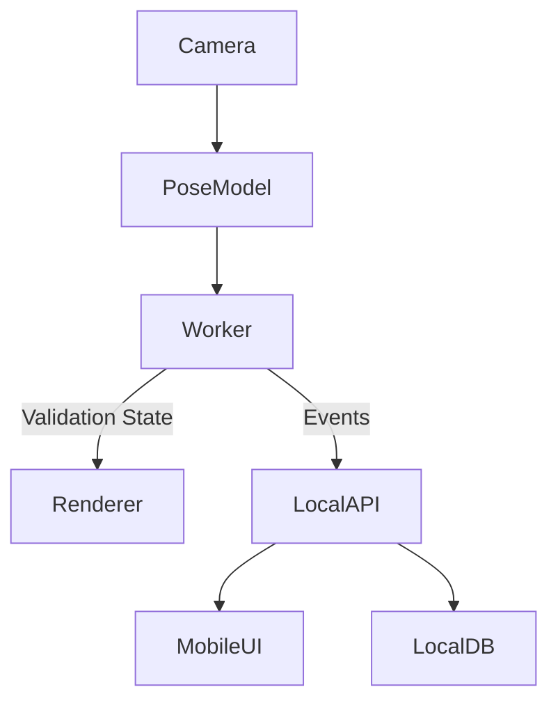
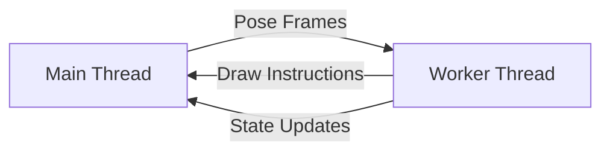
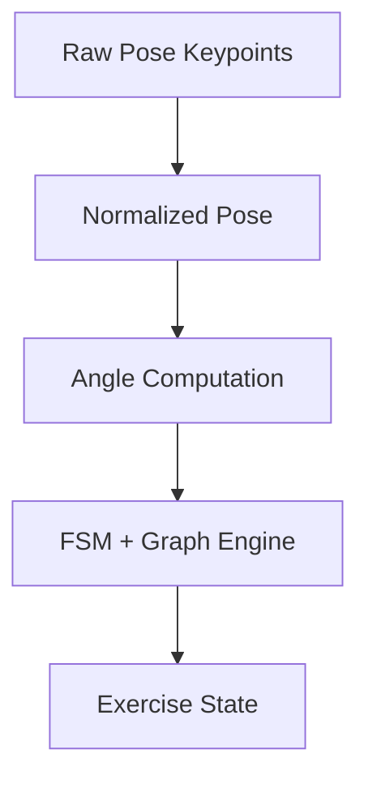
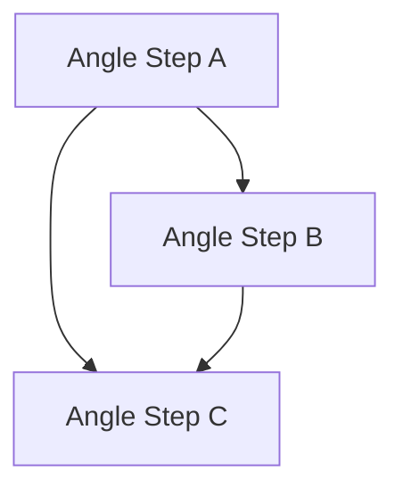
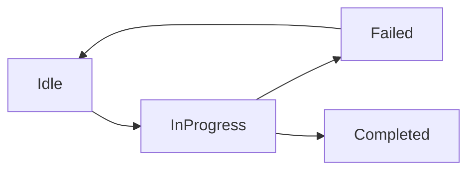
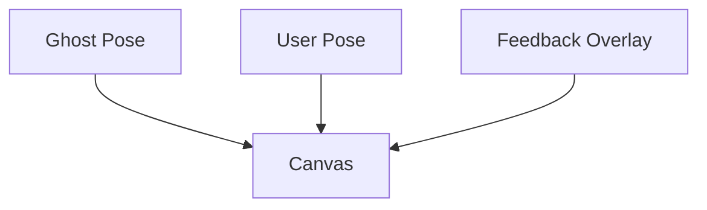
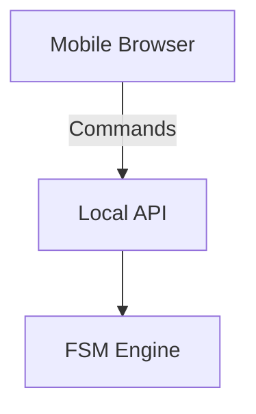
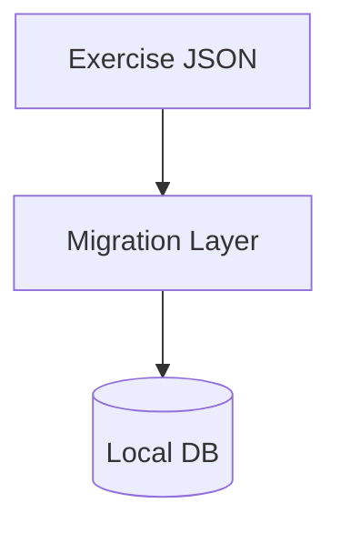

# 🪞 Smart Fitness Mirror – Architecture

This document describes the high-level architecture of the **Smart Fitness Mirror** system. The focus is on **offline-first**, **deterministic behavior**, and **performance on embedded hardware (Radxa-class SBC)**.

---

## 1. System Goals

- Run fully **offline**
- Respect user **privacy** (no cloud by default)
- Work on **limited hardware**
- Allow **iterative exercise design**
- Separate **logic, rendering, and data**

---

## 2. High-Level Overview

The system is composed of five main layers:

1. Pose Inference
2. Validation Engine (FSM + Graphs)
3. Rendering Engine
4. Local API
5. Local Storage

---

## 3. Runtime Architecture

### 3.1 Main Thread vs Workers

The main UI thread is kept lightweight. Heavy computation runs in Web Workers.

**Main Thread responsibilities:**

- Canvas rendering
- UI state
- Camera capture
- Network I/O

**Worker responsibilities:**

- Pose normalization
- FSM execution
- Graph traversal
- Temporal constraint validation
- Scoring

---

## 4. Pose Processing Pipeline

Key characteristics:

- Deterministic
- Time-aware
- Noise-tolerant

---

## 5. Exercise Model

Exercises are defined as **versioned JSON graphs**.

Each exercise defines:

- Moving points / angles
- Expected min/max sequences
- Parallel paths
- Temporal constraints

JSON is the **source of truth**.

---

## 6. Validation Engine (FSM + Graphs)

Each exercise run is evaluated by a **Finite State Machine** enhanced with **directed graphs**.

FSM state is enriched with:

- Current graph nodes
- Time windows
- Partial completion

---

## 7. Rendering Architecture

Rendering uses **Canvas 2D** with layered drawing passes.

Rendering uses **draw instructions**, not raw logic.

---

## 8. Control & Interaction

The mirror has **no touchscreen**.

Control is provided via:

- QR code
- Local web UI (mobile)
- Optional gestures or hardware buttons

---

## 9. Data & Storage

All data is stored locally.

Stored data includes:

- Exercises
- Tutor exercises
- Execution runs
- Metrics

The database is **never exposed directly**.

---

## 10. Design Principles Summary

- JSON as contracts
- FSMs over heuristics
- Graphs for parallelism
- Workers for performance
- Canvas for efficiency
- Local-first always

---

## 11. Future Extensions

- Optional DTW-based scoring
- Tutor recording mode
- Exercise editor UI
- Multi-camera support

---

🪞 _This architecture is designed to evolve without breaking core assumptions._
