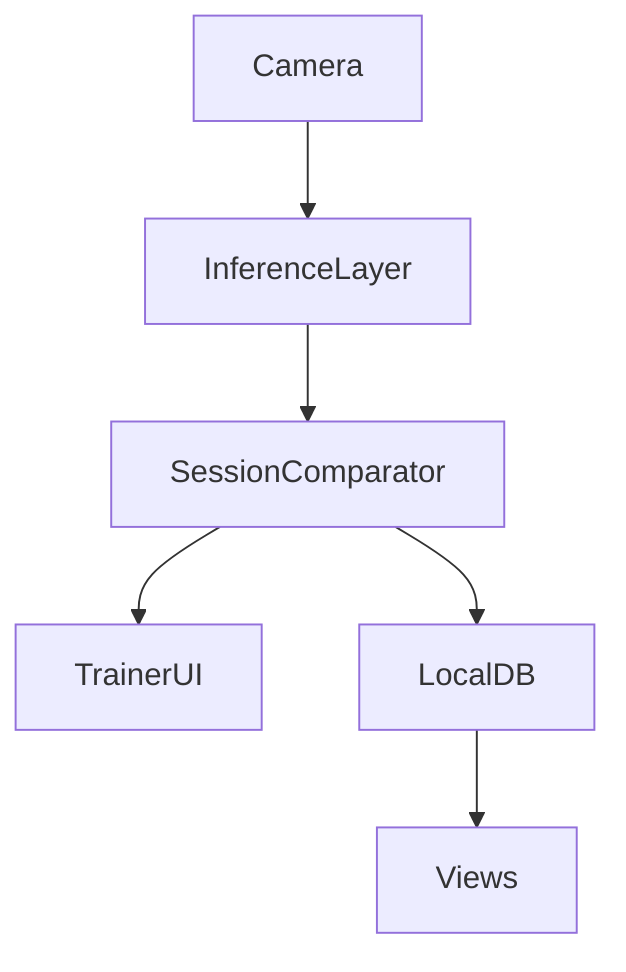
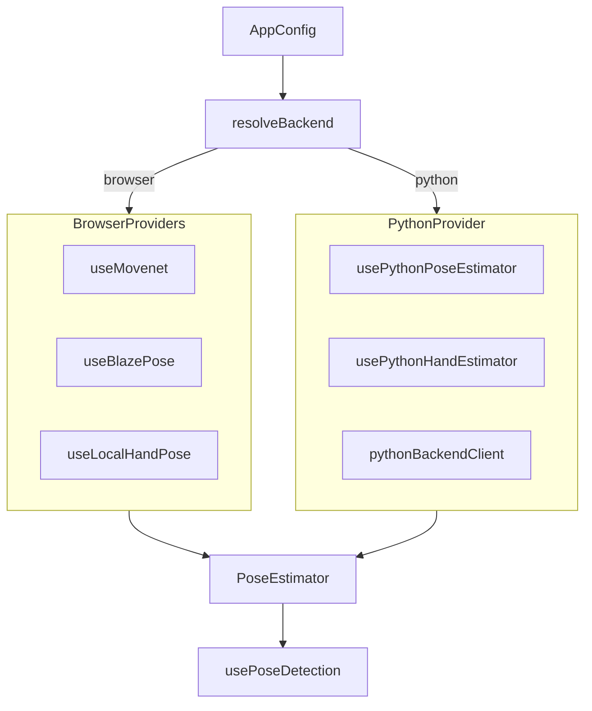
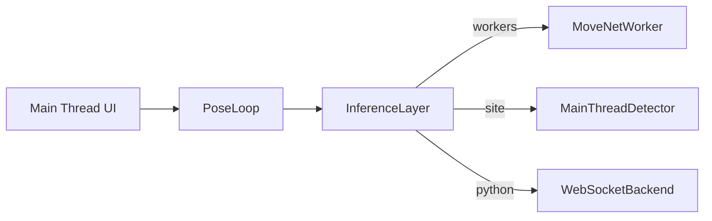
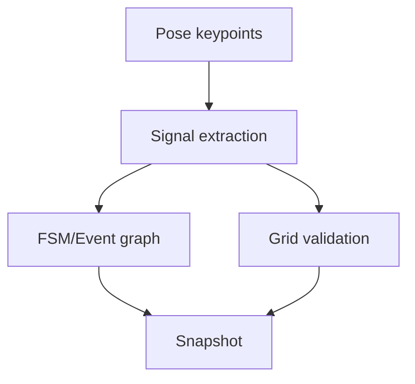

# Smart Fitness Mirror - Architecture

This document describes the implemented architecture for the Smart Fitness Mirror project. The current system supports three deployment targets sharing a single codebase, optimized for offline execution, deterministic validation, and limited SBC-class hardware.

---

## 1. System Goals

- Run fully offline (no cloud dependency) across all deployment targets
- Preserve privacy by keeping data local
- Keep UI responsive on limited hardware
- Use versioned JSON exercise definitions as source of truth
- Separate detection, validation, rendering, and persistence

---

## 2. Deployment Targets

Three distinct runtime configurations are supported through build-time environment variables and a mode-gated Vite config. The inference abstraction layer is shared across all three — target selection requires no changes to consumer code.

| Target | `runtime.execution` | Inference | Camera | Build command |
|---|---|---|---|---|
| V1 — Python | `python` | Python WebSocket backend | Hardware (MJPEG/stream) | `pnpm start:python` |
| V2 — WASM/WebGL | `workers` | TF.js browser workers | Hardware (MJPEG/stream) | `pnpm start` |
| V3 — PWA | `site` | TF.js browser workers | Device camera (getUserMedia) | `pnpm build:pwa` |

The active target is determined by `VITE_KGM_RUNTIME_EXECUTION` at build time, which seeds the initial `AppConfig` in localStorage.

---

## 3. Runtime Topology



Main subsystems:

1. Inference layer (abstracts over browser workers / Python backend)
2. Session comparator (FSM + graph + grid metrics)
3. Trainer flow (score threshold, rep progression, routine progression)
4. Local persistence layer
5. Configuration layer (`/config` + localStorage)

---

## 4. Inference Abstraction Layer

The `src/inference/` module decouples pose/hand detection from the rest of the application. Consumer code never decides which backend to use — the inference layer resolves that from configuration.



Entry points:

- `usePoseInference()` — returns a `PoseEstimator` regardless of backend
- `useHandInference()` — returns a `HandEstimator` regardless of backend

`resolveBackend.ts` maps `runtime.execution`:

- `"python"` → `"python"` (WebSocket backend)
- `"workers"` or `"site"` → `"browser"` (TF.js providers)

Providers live in `src/inference/providers/` and are never imported directly by views or context providers.

---

## 5. UI Library Layer

Pure presentational components live in `src/ui/`. They have no dependencies on hooks, context, or services — only React, types, and SCSS.

Connected wrappers in `src/components/` inject project-specific logic (hooks, context, services) into the UI components.

```
src/ui/          → Pure components (Button, Skeleton, ExerciseCard, etc.)
src/components/  → Connected wrappers (Button + useHandPose, etc.)
```

This separation allows updating the UI independently from project logic.

---

## 6. Main Thread and Worker Strategy

The project supports three runtime execution modes via app config: `workers`, `site`, or `python`.



Current implementation:

- MoveNet can run in a dedicated worker (worker-first path with fallback)
- BlazePose runs in browser with local MediaPipe runtime (offline assets)
- Python backend provides camera capture + inference via WebSocket
- Rendering and camera stream remain on main thread

`"site"` and `"workers"` both resolve to browser inference — the distinction controls worker usage, not the provider.

---

## 7. Pose and Validation Pipeline



`SessionComparator` computes:

- FSM/event-graph progress (`score`, `matchedCount`, `completion`, `completed`)
- Grid progress (`gridScore`, `gridProgress`, matched keypoints)
- Active signals for diagnostics and overlays

Validation behavior in Trainer is config-driven:

- `evaluation.type = fsm`: score from FSM/event-graph metrics
- `evaluation.type = grid`: score from grid metrics

---

## 8. Routine Execution Flow

Trainer loop behavior:

1. Load current routine item exercise
2. Process live pose snapshots continuously
3. Compute score percent according to configured evaluation type
4. Mark a rep complete when score reaches threshold 80
5. Move to next exercise when target reps are completed
6. Show routine complete message when last exercise finishes

This logic is deterministic and state-driven.

---

## 9. Configuration Architecture

Configuration is seeded from `src/config/defaultAppConfig.json` and persisted in localStorage.

Current config domains:

- `models`:
  - `poseModel`: `movenet` | `blazepose`
  - model variants for MoveNet, BlazePose, HandPose
- `camera`:
  - `source`: `web` | `streamUrl`
  - `streamUrl`: MJPEG endpoint URL
- `runtime`:
  - `execution`: `workers` | `site` | `python`
  - `backend`: `webgl` | `wasm`
  - `pythonWebSocketUrl`: WebSocket URL for Python backend
- `evaluation`:
  - `type`: `fsm` | `grid`

Config updates are propagated through a custom window event so active views can react without reload.

The configuration wizard (`pnpm configure`) generates this file interactively.

A separate `src/config/testAppConfig.json` provides browser-friendly defaults (webgl, site execution) for the test suite, loaded automatically in test setup.

### Build-time overrides

Environment variables seeded into the bootstrap override applied on first visit:

| Variable | Effect |
|---|---|
| `VITE_KGM_RUNTIME_EXECUTION` | Sets `runtime.execution` |
| `VITE_KGM_PYTHON_WS_URL` | Sets `runtime.pythonWebSocketUrl` |
| `VITE_KGM_PYTHON_STREAM_URL` | Sets `runtime.pythonStreamUrl` |

For the PWA target, `.env.pwa` sets `VITE_KGM_RUNTIME_EXECUTION=site`. The Vite `--mode pwa` flag loads this file and activates the PWA plugin in `vite.config.ts`.

---

## 10. PWA Build System

The PWA plugin is activated exclusively in `--mode pwa` (Vite `defineConfig({ mode })` guard), so V1 and V2 builds are unaffected.

```
vite build --mode pwa
  └─ loads .env.pwa          → execution=site
  └─ activates VitePWA()     → generates sw.js + manifest.webmanifest
  └─ Workbox precaches app shell (JS, CSS, HTML, WASM)
  └─ Workbox runtime-caches /models/** on first use (CacheFirst, 1-year TTL)
```

Caching strategy:

- **App shell** (JS, CSS, HTML, WASM fonts): precached at service worker install — available offline immediately after first visit
- **ML models** (`/models/**`): excluded from precache, cached with `CacheFirst` on first inference run — available offline after the first exercise session

This two-phase approach keeps the install cache small (~3.7 MB app shell) and defers model caching (potentially 50–200 MB) until models are actually used.

PWA icons are generated from `public/icons/kinkagami-source.svg` using `@vite-pwa/assets-generator`:

```bash
pnpm pwa:icons    # regenerate if source SVG changes
```

Node.js 22+ is required for `pnpm build:pwa` and `pnpm dev:pwa` (Vite 7 + Workbox use `crypto.hash` from Node 21.7+). A `.nvmrc` pins the requirement.

---

## 11. Data and Storage

- Exercises and routines are stored locally via PouchDB (IndexedDB in browser, LevelDB in Node)
- JSON definitions are canonical and can be migrated into DB records
- No client direct DB access from remote devices
- No database files in `/public`

---

## 12. Offline Model Assets

Model assets are served locally from `public/models`.

Highlights:

- MoveNet: local TFJS model URLs
- BlazePose: local MediaPipe assets under `public/models/blazepose/mediapipe`
- HandPose: local detector/landmark model paths

For V1/V2, models load directly from the filesystem on app start. For V3 (PWA), models are fetched over HTTP on first use and cached by the Workbox `CacheFirst` handler — identical behavior from the inference layer's perspective.

---

## 13. Project Structure

```
src/
├── inference/           Inference abstraction layer
│   ├── providers/       Backend-specific: useMovenet, useBlazePose, pythonBackendClient
│   ├── usePoseInference.ts    Unified pose detection hook
│   ├── useHandInference.ts    Unified hand detection hook
│   ├── resolveBackend.ts      Config → backend resolver
│   └── types.ts               Shared inference types
├── ui/                  Pure presentational components (no project deps)
├── components/          Connected wrappers (inject hooks/context/services)
├── hooks/               Application hooks (thin delegates for inference)
├── context/             React context providers
├── services/            Business logic (session comparator, hand detection loop)
├── views/               Page-level views (Trainer, Canvas, Models, Create, Config)
├── types/               TypeScript type definitions
├── config/              Default and test app configuration
├── db/                  Database service, exercise/routine seeds
├── workers/             Web Worker implementations (MoveNet)
├── utils/               Utility functions
├── locales/             i18n translation files
└── tests/               Test suite
```

---

## 14. Design Principles

- Local-first and offline-first by default across all targets
- Explicit state machines over implicit heuristics
- JSON contracts over hardcoded logic
- Small composable modules
- Performance-aware runtime placement (worker vs main thread)
- UI decoupled from logic via presentational/connected component split
- Inference backend decoupled from consumer code via abstraction layer — new targets require changes only in `resolveBackend.ts` and `vite.config.ts`

---

## 15. Known Extension Points

- Additional scoring modes
- More runtime partitioning into workers
- Advanced routine feedback and post-session analytics
- Exercise authoring UX improvements
- New inference backends (e.g. ONNX, WebGPU)
- Optional PouchDB sync to a remote CouchDB endpoint for cross-device data (hook point already exists in `dbService.ts`)

---

This architecture is intended to evolve incrementally while preserving deterministic behavior and offline operation across all deployment targets.
