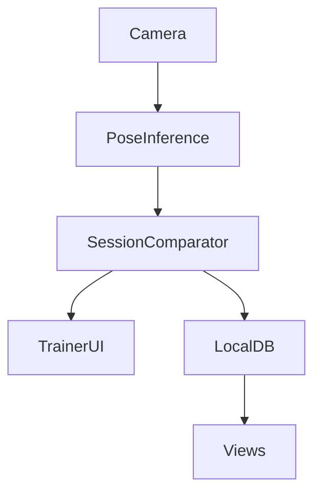
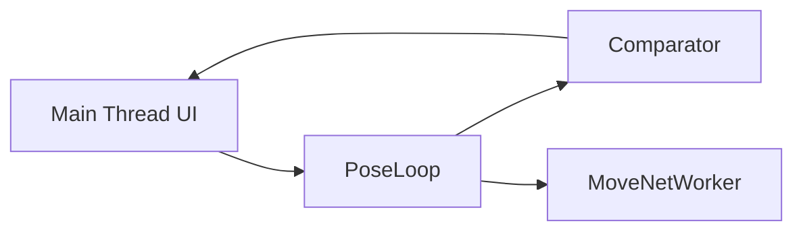
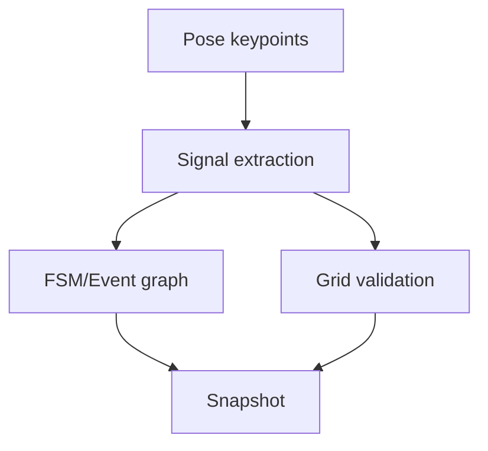

# Smart Fitness Mirror - Architecture

This document describes the implemented architecture for the Smart Fitness Mirror project. The current system is optimized for offline execution, deterministic validation, and limited SBC-class hardware.

---

## 1. System Goals

- Run fully offline (no cloud dependency)
- Preserve privacy by keeping data local
- Keep UI responsive on limited hardware
- Use versioned JSON exercise definitions as source of truth
- Separate detection, validation, rendering, and persistence

---

## 2. Runtime Topology

Main subsystems:

1. Pose inference (MoveNet / BlazePose / HandPose)
2. Session comparator (FSM + graph + grid metrics)
3. Trainer flow (score threshold, rep progression, routine progression)
4. Local persistence layer
5. Configuration layer (`/config` + localStorage)

---

## 3. Main Thread and Worker Strategy

The project supports runtime execution mode via app config: `workers` or `site`.

Current implementation:

- MoveNet can run in a dedicated worker (worker-first path with fallback)
- Session comparator runtime can be switched between worker and site modes
- BlazePose runs in browser with local MediaPipe runtime (offline assets)
- Rendering and camera stream remain on main thread

This hybrid model keeps critical UI interactions stable while offloading selected heavy tasks.

---

## 4. Pose and Validation Pipeline

`SessionComparator` computes:

- FSM/event-graph progress (`score`, `matchedCount`, `completion`, `completed`)
- Grid progress (`gridScore`, `gridProgress`, matched keypoints)
- Active signals for diagnostics and overlays

Validation behavior in Trainer is config-driven:

- `evaluation.type = fsm`: score from FSM/event-graph metrics
- `evaluation.type = grid`: score from grid metrics

---

## 5. Routine Execution Flow

Trainer loop behavior:

1. Load current routine item exercise
2. Process live pose snapshots continuously
3. Compute score percent according to configured evaluation type
4. Mark a rep complete when score reaches threshold 80
5. Move to next exercise when target reps are completed
6. Show routine complete message when last exercise finishes

This logic is deterministic and state-driven.

---

## 6. Configuration Architecture

Configuration is seeded from `src/config/defaultAppConfig.json` and persisted in localStorage.

Current config domains:

- `models`:
  - `poseModel`: `movenet` | `blazepose`
  - model variants for MoveNet, BlazePose, HandPose
- `camera`:
  - `flow`: `web`
- `runtime`:
  - `execution`: `workers` | `site`
- `evaluation`:
  - `type`: `fsm` | `grid`

Config updates are propagated through a custom window event so active views can react without reload.

---

## 7. Data and Storage

- Exercises and routines are stored locally
- JSON definitions are canonical and can be migrated into DB records
- No client direct DB access from remote devices
- No database files in `/public`

---

## 8. Offline Model Assets

Model assets are served locally from `public/models`.

Highlights:

- MoveNet: local TFJS model URLs
- BlazePose: local MediaPipe assets under `public/models/blazepose/mediapipe`
- HandPose: local detector/landmark model paths

This allows startup and validation without network access.

---

## 9. Design Principles

- Local-first and offline-first by default
- Explicit state machines over implicit heuristics
- JSON contracts over hardcoded logic
- Small composable modules
- Performance-aware runtime placement (worker vs main thread)

---

## 10. Known Extension Points

- Additional scoring modes
- More runtime partitioning into workers
- Advanced routine feedback and post-session analytics
- Exercise authoring UX improvements

---

This architecture is intended to evolve incrementally while preserving deterministic behavior and offline operation.
